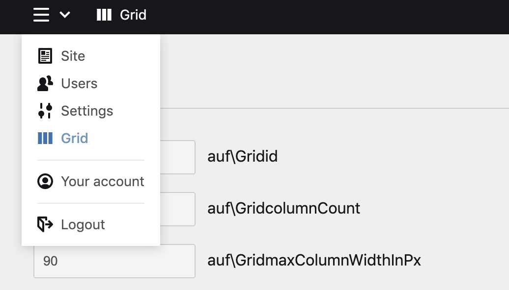
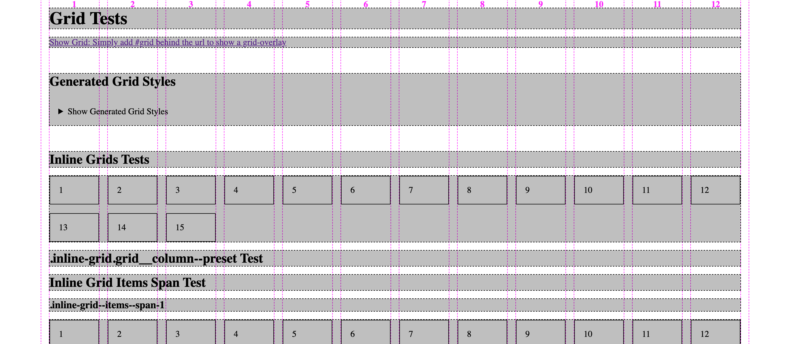
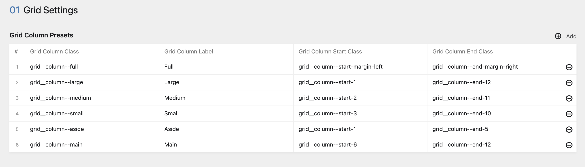

# auf-grid

## Installation

### CSS Setup

1. Login to your panel, open the »grid«-panel and hit the »generate CSS«-Button at the bottom.



2. Include the generated grid styles in the head of your document:

```php
<html>
  <head>
    <?= css('assets/css/auf-grid.css') ?>
  </head>
  <body></body>
</html>
```

***Important!***

After you changed any grid setting, you have to generate CSS in the grid-panel again!

3. Copy the test images from ```auf-grid/assets/images``` folder to your sites assets folder:

```{{your-site}}/assets/images/grid-test-2.jpg```

4. Go to our test page ```http://{your-kirby-site}/grid-test``` and check if everyting is working. It should look like this [Complete Test Page Screenshot](documentation/grid-tests-full.png):



5. Add the hash '#grid' to any page url and you get a grid overlay to check your settings

6. Please read the [auf-grid.css](assets/css/auf-grid.css) for all available classes which you can use in your components.

- - - - - - - - - - - - - - - - - - - - - - - - - - - - - - - - - - - - - - - - - - - - 

### Grid Column Presets Site Setup

If you want to create custom column presets you can do so.

1. Implement our grid_settings section somewhere in your site.yml:

```site.yml
title: Site

tabs:
  settings:
    sections:
      grid_settings: auf_grid/grid_settings
```

2. Add some meaningfull presets.

Add »grid__column--full« to the presets, if you want use the full page width. This preset will be handled a little differently for you.



3. ***Important***: (Re-)Generate the grid CSS in the grid-panel to create the new preset css classes!!!! 

### Setup your component blueprint (i.e. builder-block)

```
fields:
  grid_section_headline:
    type: headline
    label: Grid System
  
  grid_column_preset:
    extends: grid_column_preset

  grid_column_start_class:
    extends: auf_grid/fields/grid_column_start_class
    width: 1/2
    when:
      grid_column_preset: grid__column--custom
  
  grid_column_end_class:
    extends: auf_grid/fields/grid_column_end_class
    width: 1/2
    when:
      grid_column_preset: grid__column--custom
```

### use in your snippet

```php

use auf\Grid;

$grid = new Grid();

$columnSpan = $grid->getGridColumnSpanByStartAndEndColumnClasses('grid__column--start-1', 'grid__column--end-3');

$spanWidthInPx = $grid->getGridColumnSpanWidthInPx(3);
```

If you use grid_column_presets in your site configuration, you can pass the structure field as an argument

```php

$grid = new Grid($site->grid_column_presets()->toStructure());

$columnSpan = $grid->getGridColumnSpanByPreset('grid__column--aside');

```

### Test the grid

The plugin sets up a custom route with a virtual testpage at:

http://yourdomain.com/grid-tests


### Grid--Overlay

To check if everything is in perfect grid-condition you can show a little grid-overlay by adding the hash '#grid' behind your url.
For this to work, you need to include the grid-overlay-snippet before the body-tag.

template.php
```php
<body class="grid">
  <h1><?= $page->title() ?></h1>
  <a href="<?= url('#grid') ?>">Show Grid: Simply add #grid behind the url to show a grid-overlay</a>
  <?= snippet('auf-grid/grid-overlay'); ?>
</body>
```


- - - - - - - - - - - - - - - - - - - - - - - - - - - - - - - - - - - - - - - - - - - 

## Todos

* [X] ~~*The grid.css should be created as a file for caching and not beeing-recreated for every page request. Perhaps this is a good*~~ [2020-07-12] 

* [X] ~~*Clean up test page*~~ [2020-07-12]

* [X] ~~*Create Nice Create-Grid-Panel-View*~~ [2020-07-12]

* [X] ~~*Create Image test page*~~ [2020-07-12]

* [X] ~~*Create Grid Overlay Snippet*~~ [2020-07-12]

* [ ] Refactor grid to a nice interface

* [ ] Implement Inline Grid Classes

* [ ] Implement justify and align classes

* [ ] grid_start/end_column_classes should be created dynamically in a custom field